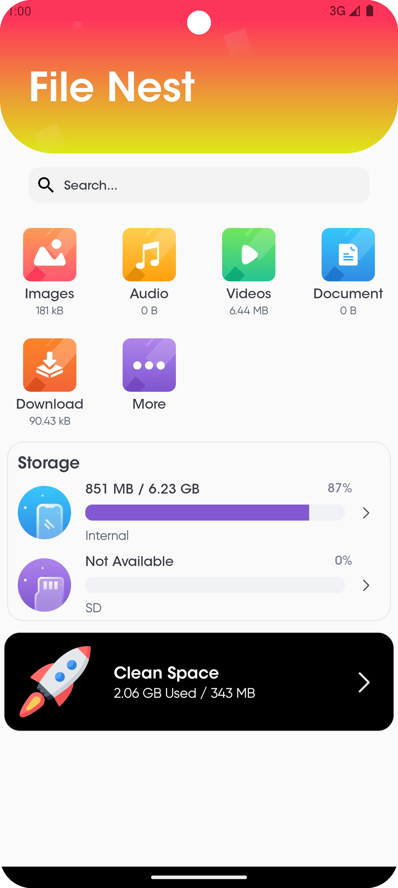
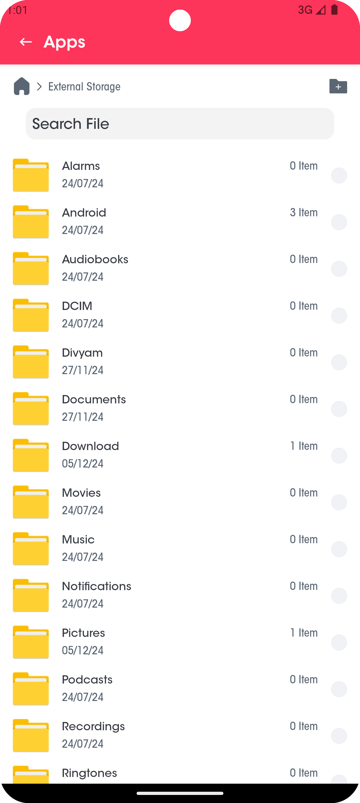
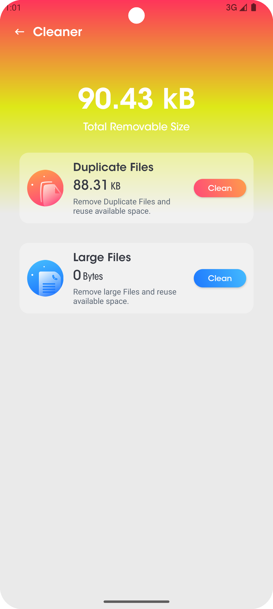

<h1 style="font-size:48px;">FileNest - Android File Manager App</h1>

FileNest is an intuitive and user-friendly file manager app designed to help users organize, manage, and explore files on their Android devices efficiently. This project is tailored for students and developers who seek a robust file management solution.

<h2 style="font-size:36px;">Features</h2>

1. File Management: Create, rename, delete, move, and copy files and folders.

2. Search Functionality: Quickly search for files by name or extension.

3. File Preview: View images, videos, and documents directly within the app.

4. Secure Access: Set up password protection to safeguard your sensitive files.

<h2 style="font-size:36px;">Installation</h2>

Clone the repository: git clone https://github.com/divyam082003/FileNest.git

Open the project in Android Studio.

Build and run the app on your Android device or emulator.

<h2 style="font-size:36px;">Screenshots</h2>

  
  
  
  

